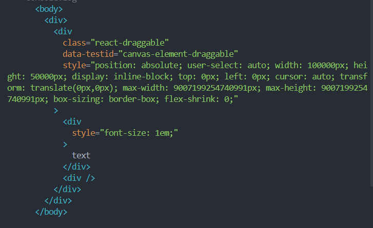

The components chosen for these tests were primitive components that first utilised any imported CSS or UI libraries. This allowed testing to be easily accomplished as testing other non-primitive components would have lead to complex calls to inner components, further increasing test run time and make it difficult for testing code to be understood.
For testing, we utilised React's testing-library. Each component was aimed to test whether:
1. Elements were tested to be rendered in the document.
2. Properties and attributes were correctly rendered, includes checking images for alt tags.
3. Correct displayed texts.
4. Any links had the correct href attribute.
5. Any buttons were able to be clicked.
6. Any inputs could be entered with a value
This ensured thorough testing to increase as much coverage over the tested components.

However, when testing canvas elements (ParentElement) that are draggable and resizable, testing-library/react was only able to provide a shallow component with its style attributes.

Approaching this test, we only tested the ParentElement for its class and style properties that correlated to any draggable or resizing properties.

For our second UI testing path, we chose to do a 'unhappy' path of an admin.
We chose to do an unhappy path because the first UI test already tested a happy path so an unhappy path would give us more information and show us if there were any bugs present if a user were to provide invalid inputs.
This unhappy path includes briefly going through the website and testing various error modals from invalid inputs.
There were several steps/errors that were in the unhappy path such as:
1. Checking mismatching passwords when registering the user.
2. Attempting to create a presentation with an empty name.
3. Attempting to create a textbox with an invalid HEX code.
4. Attempting to edit the created textbox and change its font size to empty.
5. Logging out then attempting to log back in with an incorrect password.